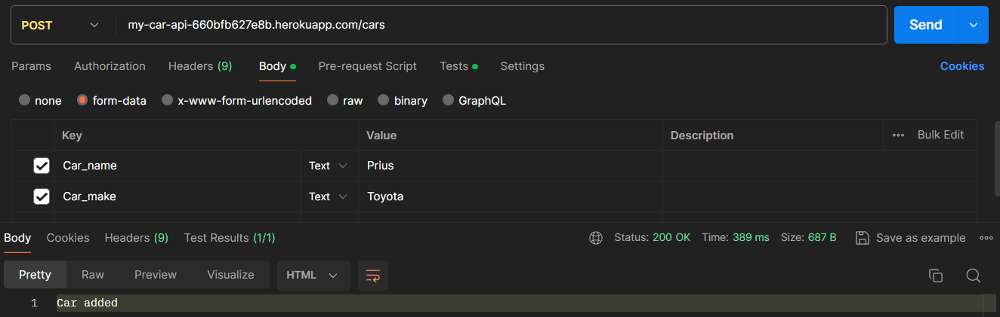
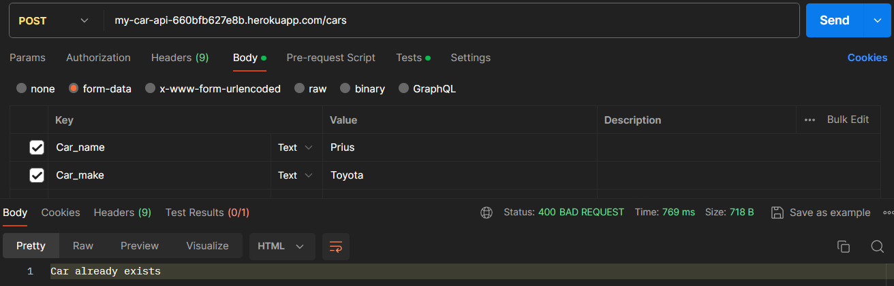
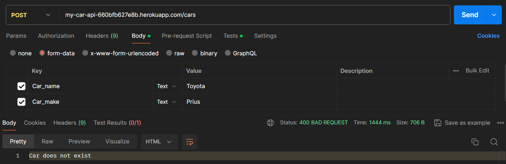
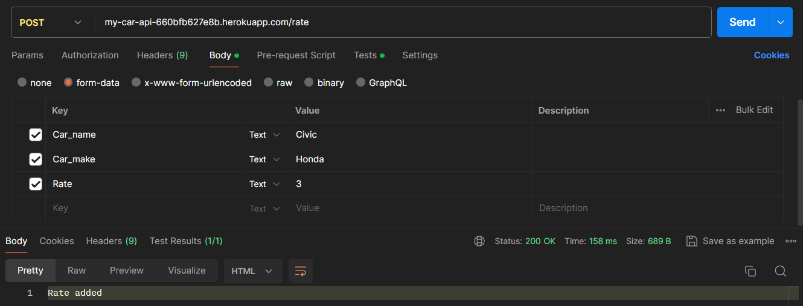
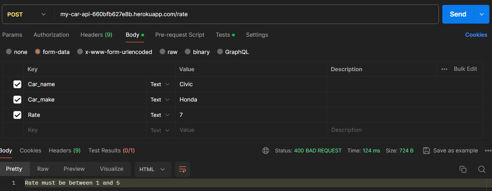
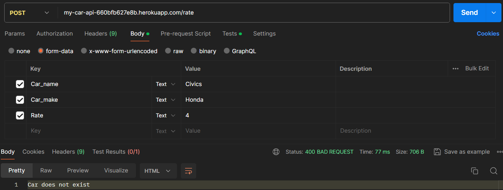
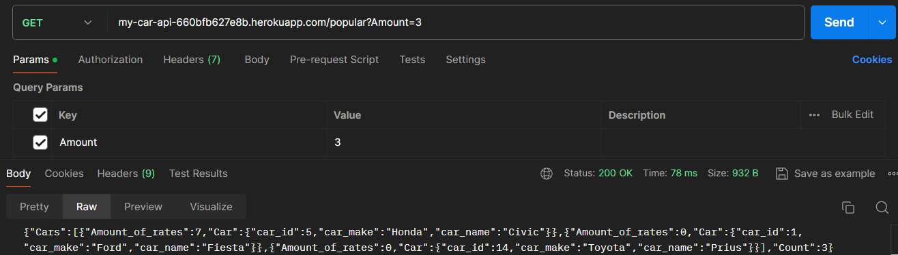
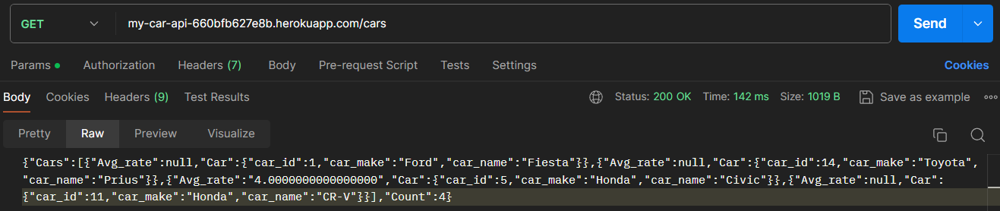

# Test scenarios
Tests are run in postman  
In the bottom there is the response and return code 

## Scenario 1
### Title: Add new car

## Scenario 2
### Title: Add car added before

## Scenario 3
### Title: Add car with wrong parameters (changed car_make with car_name)

## Scenario 4
### Title: Add a rate

## Scenario 5
### Title: Add a rate with bad value

## Scenario 6
### Title: Add a rate with bad car

## Scenario 7
### Title: Get popular cars

## Scenario 8
### Title: Get cars

